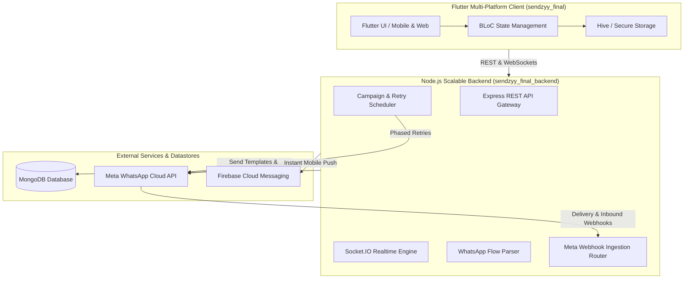

<div align="center">

# 🚀 Sendzyy — Enterprise WhatsApp Marketing & Automation Platform

### *Next-Generation Omni-Channel Marketing Monorepo Powered by Flutter & Node.js*

[](https://opensource.org/licenses/MIT)
[](https://flutter.dev)
[](https://nodejs.org)
[](https://expressjs.com)
[](https://mongodb.com)
[](https://developers.facebook.com/docs/whatsapp/cloud-api)
[](https://flutter.dev/multi-platform)

<p align="center">
  <a href="#-what-is-sendzyy">Overview</a> •
  <a href="#-core-capabilities--features">Features</a> •
  <a href="#-system-architecture">Architecture</a> •
  <a href="#-competitive-matrix">Comparison</a> •
  <a href="#-quickstart-guide">Quickstart</a> •
  <a href="#-configuration--environment-variables">Configuration</a> •
  <a href="#-frequently-asked-questions-faq">FAQ</a>
</p>

</div>

---

## 📖 What is Sendzyy?

**Sendzyy** is a full-stack, enterprise-grade **WhatsApp Marketing, Automation, and Commerce Platform** built to help businesses scale customer communication, automate conversational funnels, and boost conversions using the official **Meta WhatsApp Cloud API**.

Engineered as a high-performance **monorepo**, Sendzyy unites an intuitive, cross-platform **Flutter frontend** (supporting Android, iOS, Web, and Desktop) with an event-driven **Node.js/Express backend** backed by MongoDB, Firebase Cloud Messaging (FCM), and automated multi-phase retry pipelines.

### Why Choose Sendzyy?
- **Zero Third-Party Vendor Markup**: Connect directly to your Meta WhatsApp Business Account (WABA) with Embedded Signup.
- **Interactive WhatsApp Flows**: Build native, in-chat interactive forms, booking flows, and questionnaires without redirecting users out of WhatsApp.
- **WhatsApp Commerce & Product Catalogs**: Showcase inventories, accept carts, and manage incoming orders natively.
- **Multi-Phase Smart Retry System**: Automatically re-attempt failed messages through scheduled phased intervals to maximize delivery rates.
- **No-Code Conversational Chatbot**: Design visual branching chatbot flows with trigger keywords and fallback logic.

---

## ✨ Core Capabilities & Features

### 1. 📢 Mass Broadcast Campaigns & Smart Scheduler
- Execute high-volume targeted campaigns with dynamic personalization tokens (`{{1}}`, `{{name}}`, `{{order_id}}`).
- Schedule campaigns across global timezones with rate limiting to maintain Tier 1–4 Meta Quality Ratings.
- Real-time progress bars tracking queued, sent, delivered, read, and failed statuses.

### 2. ⚡ WhatsApp Flows (Native In-App Micro-Apps)
- Design, test, and publish native interactive **Meta WhatsApp Flows**.
- Capture verified leads, schedule appointments, run surveys, and collect feedback inside WhatsApp.
- Automatic payload parsing and webhook ingestion into your internal CRM database.

### 3. 🛍️ WhatsApp Commerce & Product Catalogs
- Synchronize Facebook Commerce Manager catalogs directly into Sendzyy.
- Send Single-Product Messages (SPM) and Multi-Product Messages (MPM).
- Real-time order cart reception, customer checkout notifications, and receipt generation.

### 4. 🤖 Visual No-Code Chatbot Builder
- Drag-and-drop or node-based logic engine to automate customer journeys 24/7.
- Support for interactive quick-reply buttons, list pickers, media cards, and keyword trigger routers.
- Seamless human agent handover with dedicated team assignment.

### 5. 🔄 Intelligent Multi-Phase Campaign Retry Engine
- Built-in multi-phase retry scheduler (`Phase 1 -> Phase 2 -> Phase N`) with customizable delay intervals.
- Handles temporary network failures, recipient phone power-off scenarios, and rate-limit backoffs.
- Version-controlled retry configurations with historical auditing.

### 6. 💬 Shared Live Team Inbox
- Collaborative multi-agent live chat interface with real-time WebSockets.
- Filter conversations by Unread, Assigned, Closed, or Tagged.
- Push notifications delivered via Firebase Cloud Messaging (FCM).

### 7. 📊 Advanced Analytics & PDF Export
- Deep attribution reporting: Sent vs. Delivered vs. Read vs. Clicked rates.
- Generate and download branded PDF campaign performance reports.
- Comprehensive webhook auditing and delivery diagnostic tools.

---

## 🏗️ System Architecture



---

## 📂 Monorepo Repository Structure

```text
sendzyy/
├── .gitignore                      # Global unified Git ignore rules
├── README.md                       # Master project documentation
│
├── sendzyy_final/                  # Flutter Cross-Platform Client
│   ├── lib/
│   │   ├── features/
│   │   │   ├── auth/               # User authentication & onboarding
│   │   │   ├── catalog/            # WhatsApp Commerce & product catalog
│   │   │   ├── chatbot/            # Automated conversational bot builder
│   │   │   ├── chat/               # Live multi-agent team inbox
│   │   │   ├── clients/            # CRM contact list & audience tags
│   │   │   ├── messages/           # Broadcast campaign management
│   │   │   ├── reports/            # PDF generation & metric analytics
│   │   │   ├── retry/              # Multi-phase retry visualizer
│   │   │   ├── templates/          # Meta message template creator
│   │   │   └── whatsapp_flows/     # Meta Flows builder & previewer
│   │   ├── main.dart               # App entrypoint
│   │   └── firebase_options.dart   # Cross-platform FCM initialization
│   ├── pubspec.yaml                # Flutter dependencies
│   └── web/, android/, ios/        # Platform-specific native shells
│
└── sendzyy_final_backend/          # Node.js Express REST Backend
    ├── controllers/                # Request controllers (Flows, Catalog, Auth, Campaigns)
    ├── models/                     # Mongoose database models (Orders, Flows, Logs)
    ├── services/                   # Business logic (CampaignExecutor, RetryScheduler, FCM)
    ├── middleware/                 # Meta HMAC signature verification, auth guards
    ├── scheduler.js                # Background campaign dispatching
    ├── server.js                   # Primary Express server & socket orchestrator
    └── package.json                # Node dependencies
```

---

## 📊 Competitive Matrix

| Feature | Sendzyy | WATI | AiSensy | Twilio API |
| :--- | :---: | :---: | :---: | :---: |
| **Open & Self-Hostable** | ✅ Yes | ❌ No | ❌ No | ❌ No |
| **No Per-Message Platform Markup** | ✅ Yes | ❌ No | ❌ No | ❌ No |
| **WhatsApp Flows Builder** | ✅ Built-in | ⚠️ Limited | ⚠️ Limited | ❌ Code Only |
| **WhatsApp Product Catalog** | ✅ Native | ⚠️ Add-on | ⚠️ Add-on | ❌ Manual API |
| **Multi-Phase Automated Retry Engine** | ✅ Yes | ❌ No | ❌ No | ❌ No |
| **Cross-Platform Mobile App (Flutter)** | ✅ Android/iOS/Web | ⚠️ Basic Mobile | ⚠️ Basic Mobile | ❌ None |
| **Meta Embedded Signup** | ✅ Integrated | ✅ Integrated | ✅ Integrated | ❌ Manual WABA |

---

## ⚡ Quickstart Guide

### Prerequisites
- **Flutter SDK**: `^3.19.0` or higher
- **Node.js**: `v18.x` or `v20.x` LTS
- **MongoDB**: `v6.0+` locally or MongoDB Atlas URI
- **Meta Developer Account**: Registered Meta App with WhatsApp Business API access

---

### 1. Backend Setup (`sendzyy_final_backend`)

```bash
# Navigate to backend directory
cd sendzyy_final_backend

# Install dependencies
npm install

# Setup environment variables
cp .env.example .env
# Edit .env with your MongoDB URI, JWT Secret, and Meta API Credentials

# Start the development server
npm run dev
# Or start in production with PM2
npm start
```

### 2. Frontend Setup (`sendzyy_final`)

```bash
# Navigate to frontend directory
cd sendzyy_final

# Fetch dependencies
flutter pub get

# Run on your preferred platform
flutter run -d chrome       # Launch Web Dashboard
flutter run -d windows      # Launch Windows Desktop App
flutter run -d android      # Launch on Android Emulator / Device
flutter run -d ios          # Launch on iOS Simulator (macOS required)
```

---

## ⚙️ Configuration & Environment Variables

Create a `.env` file in `sendzyy_final_backend/` with the following keys:

| Environment Variable | Description | Example / Default |
| :--- | :--- | :--- |
| `PORT` | Backend HTTP port | `5000` |
| `MONGO_URI` | MongoDB connection connection string | `mongodb://localhost:27017/sendzyy` |
| `JWT_SECRET` | Secret key for JSON Web Tokens | `your_ultra_secure_jwt_secret` |
| `META_APP_ID` | Meta Developer App ID | `123456789012345` |
| `META_APP_SECRET` | Meta Developer App Secret | `abc123def456...` |
| `META_ACCESS_TOKEN` | System User Access Token | `EAAB...` |
| `WHATSAPP_PHONE_NUMBER_ID` | Meta WhatsApp Sender Phone Number ID | `109876543210987` |
| `META_WEBHOOK_VERIFY_TOKEN` | Inbound Webhook verification token | `my_custom_verify_token` |
| `FIREBASE_SERVER_KEY` | Firebase Cloud Messaging server key | `AAA...` |

---

## ❓ Frequently Asked Questions (FAQ)

### What is Meta WhatsApp Cloud API?
The Meta WhatsApp Cloud API allows developers and businesses to programmatically send and receive WhatsApp messages directly through Meta's cloud infrastructure without requiring on-premise hardware.

### How does Sendzyy help reduce WhatsApp marketing costs?
Most SaaS aggregators charge 20%–50% markup on top of Meta's official conversation rates. Sendzyy connects directly to your Meta Business Account via Embedded Signup, meaning you **only pay Meta's base conversation charges**.

### What platforms does the frontend support?
Sendzyy is built using Flutter, supporting **Web browsers (Chrome, Edge, Safari)**, **Android APKs**, **iOS**, and **Desktop (Windows, macOS, Linux)** from a single unified codebase.

### How does the multi-phase retry system work?
When sending bulk messages, temporary recipient issues (network offline, expired sessions, or carrier delays) can lead to delivery failures. Sendzyy automatically puts unconfirmed messages into scheduled retry phases (e.g., Phase 1 after 2 hours, Phase 2 after 6 hours), maximizing campaign conversion rates without duplicate messaging.

---

## 🤝 Contributing & Community

Contributions make the open-source community a vibrant space to build and innovate.
1. Fork the Project
2. Create your Feature Branch (`git checkout -b feature/AmazingFeature`)
3. Commit your Changes (`git commit -m "Add some AmazingFeature"`)
4. Push to the Branch (`git push origin feature/AmazingFeature`)
5. Open a Pull Request

---

## 📄 License

Distributed under the **MIT License**. See `LICENSE` for more information.

<div align="center">
  <sub>Built with ❤️ for modern businesses and marketing developers worldwide.</sub>
</div>
